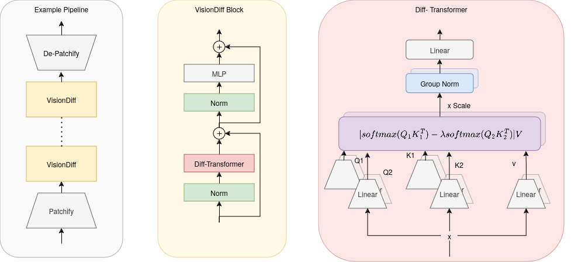

# VisionDiff

Using the [Differential Transformer](https://arxiv.org/abs/2410.05258) in a vision-friendly way, similar to [VisionMamba](https://github.com/kyegomez/VisionMamba).

<p align="center">
    
</p>


## Preamble
Absolutely no formal experimentation has been performed to validate this method - take everything with a grain of salt.

## Installation

```pip install visiondiff```

## Usage

```python
from VisionDiff import VisionDiff
dim, num_heads = 32, 4
layer1 = VisionDiff(dim, num_heads, in_channels=3)
layer2 = VisionDiff(dim, num_heads)
layer3 = VisionDiff(dim, num_heads, out_channels=3)

x = torch.zeros(1, 3, 64, 64) # Example "image"
x = layer1(x)
x = layer2(x)
x = layer3(x)

print(f"Output shape: {x.shape}") # [1, 3, 64, 64]
```

Please keep in_channel / out_channel operations at a minimum
as they tend to be computationally expensive.

## Versions

0.1.0 - *Now with more positional encoding!*